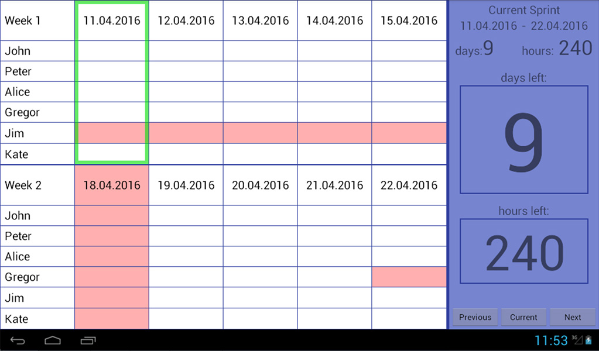

# Sprint Calendar
Android application for tablet to track some of a sprint artifacts:
* Presence/absence of team members
* total number of days and hours in sprint (taking into account holidays, vacations)
* left number of days and hours to the end of sprint (taking into account holidays, vocations)

Experiment of writing Android application and try of [Kotlin language](https://kotlinlang.org)
 
 
